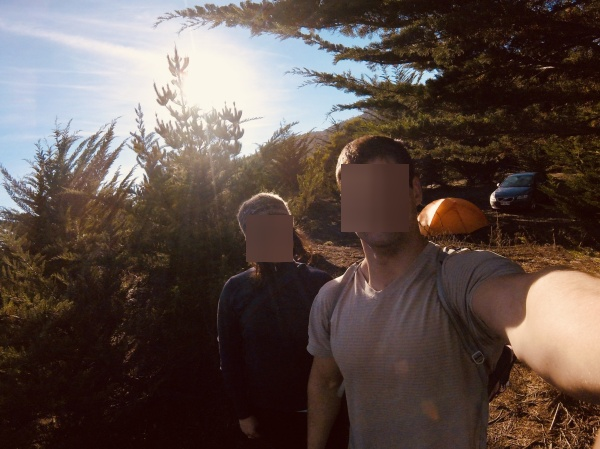

#Anonymizer

#### Description

This is a command line script with the capability of apply a filter to the faces in a picture.

####Libraries:
* argparse
* dlib
* cv2
* imutils
* numpy 

####Use:

-f or --filtermask

`select the types of mask to apply: 0= black box, 1= blurry, 2= big pixels, 3=only eyes`

black box

blurry

big pixels

only eyes

