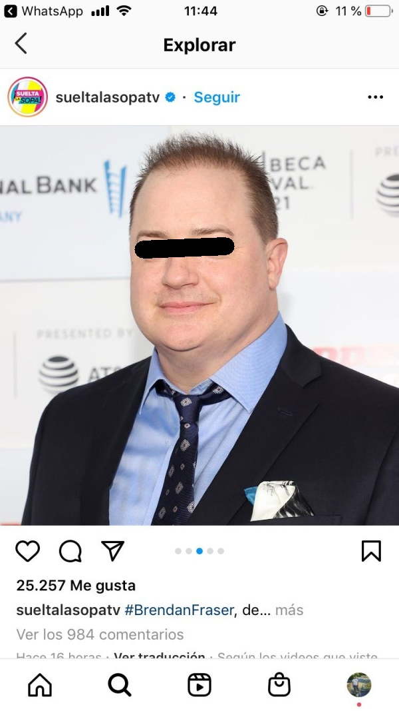

#Anonymizer

#### Description

This is a command line script with the capability of apply a filter to the faces in a picture.
Automatically deliver the image with the time when was processed.
The script convert the image to a 1200 width pixels, so can compute in a better way and don't crash your resources. 
So if you need the picture bigger than that, consider will be resized from that, but you can change this value in the script
in the parameter PROCESS_WIDTH.

####Libraries:
* argparse
* dlib
* cv2
* imutils
* numpy 

####Use:
-i or --image -> String (required)

`path to the image.`

-m or --model -> String (default=mmod_human_face_detector.dat)

`path to the model. `

-l or --label -> String (default=None)

`add a label in a rectangle at the top-left corner of the output image.`

-w or --width -> Integer (default=the same width than the original)

`the width of the output image in pixels, the ratio is conserved.`

-f or --filtermask

`select the types of mask to apply: 0= black box, 1= blurry, 2= big pixels, 3=only eyes.`

black box

blurry

big pixels

only eyes

